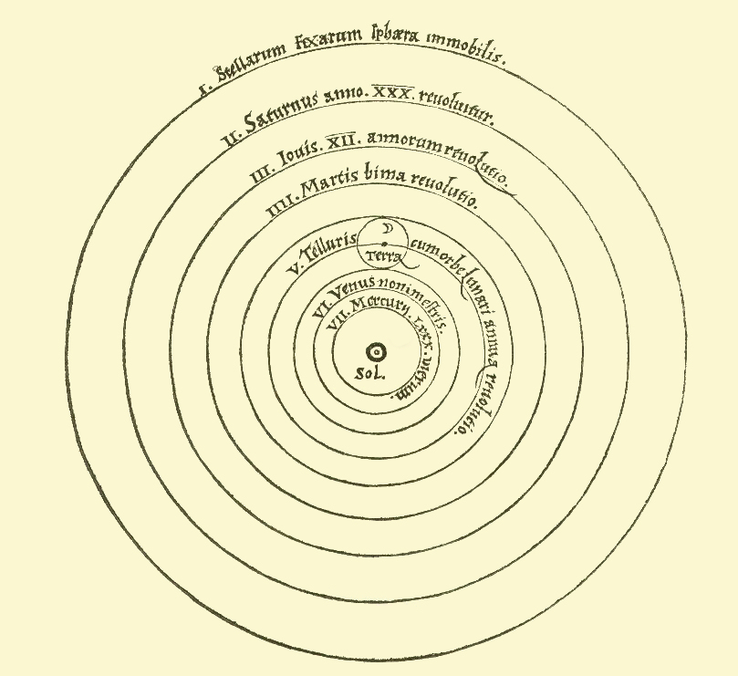
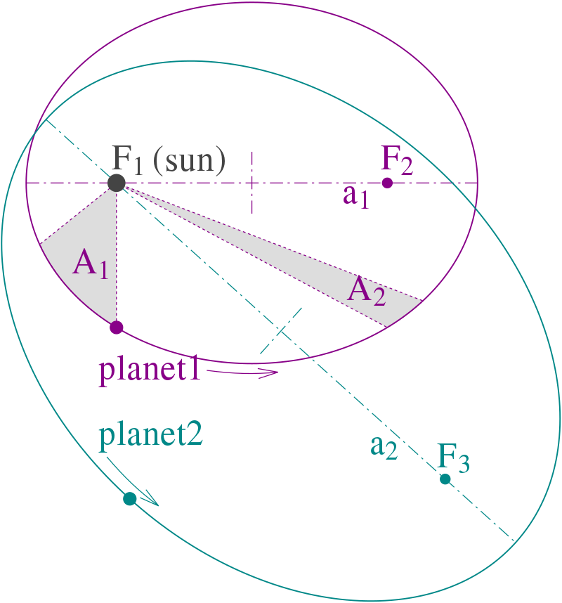

# Scientific Revolution 
* Take place in Euro in $16, 17, 18^{th}$ centuries
* Big movement for the way asking the church or Ancient in Rome, Greece about the nature, about the way things work.
* People starting emphasize the idea of **Reason**.They would answer the things base on their Observation of Science 
  
## 5 New Theories and Discoveries
### Nicolaus Copernicus (Heliocentric theory)
* Was a Renaissance mathematician and astronomer, who formulated a model of the universe that placed the Sun rather than Earth at the center of the universe
* In 1504, Copernicus began the research and propose helocentric theory that included the following axioms:
  * There is no one center in the Universe.
  * The Earth's center is not the center of the Universe.
  * The center of the universe is near the Sun.
  * The distance from the Earth to the Sun is imperceptible compared with the distance to the stars.
  * The rotation of the Earth accounts for the apparent daily rotation of the stars.
  * The apparent annual cycle of movements of the Sun is caused by the Earth revolving around it
  * the apparent retrograde motion of the planets is caused by the motion of the Earth from which one observes
  

### Johannes Kepler (Planetary Motion)
* Was a German astronomer, mathematician, and astrologer. He is a key figure in the 17th-century scientific revolution, best known for his laws of planetary motion, and his books Astronomia nova, Harmonices Mundi, and Epitome Astronomiae Copernicanae
* Johannes Kepler's most influential accomplishments in astronomy were his three Laws of Planetary Motion:
  * The planets move in elliptical orbits with the sun at a focus
  * In their orbits around the sun, the planets sweep out equal areas in equal times
  * The squares of the times to complete one orbit are proportional to the cubes of the average distances from the sun
  

* Some quotes:
  * "O telescope, instrument of much knowledge, more precious than any sceptre!"
  * "Why are things as they are and not otherwise?"
  * "I demonstrate by means of philosophy that the earth is round, and is inhabited on all sides; that it is insignificantly small, and is borne through the stars."
# Scientific_Revolution
